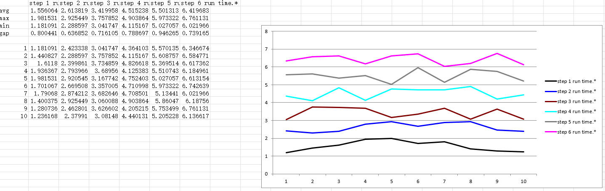

根据关键字提取（手机adb）log 中的时间信息，计算平均值并绘出折线图

# 需求来源

快速统计大量日志中包含的不同方法/算法执行时间的平均值

log 形如：

```LOG
06-05 15:15:13.218 22932 22932 D MainActivity: step 5 run time: 5.369513761587875s
06-05 15:15:13.870 26682 26690 W SQLiteConnectionPool: A SQLiteConnection object for database '/data/user/0/com....
06-05 15:15:13.871 26682 26690 I chatty  : uid=10045(com.android.providers.weather) FinalizerDaemon identical 1 line
06-05 15:15:13.872 26682 26690 W SQLiteConnectionPool: A SQLiteConnection object for database '/data/user/0/com....
06-05 15:15:14.220 22932 22932 D MainActivity: step 6 run time: 6.6173618550226845s
```

而我们关心的部分是 step * run time 后面的时间信息，我们要做的最基本的就是分别提取出每一步的时间并计算平均值。

# 执行本demo 后console 输出的内容：

```shell
python.exe .\extract_cal_time\main.py
 -------- process_ori_log_file --------
[step: step 1 run time.* ][times: 10 ]  [avg: 1.556 ] [max: 1.982 ] [min: 1.181 ] [gap(max-min): 0.800 ]
[step: step 2 run time.* ][times: 10 ]  [avg: 2.614 ] [max: 2.925 ] [min: 2.289 ] [gap(max-min): 0.637 ]
[step: step 3 run time.* ][times: 10 ]  [avg: 3.420 ] [max: 3.758 ] [min: 3.042 ] [gap(max-min): 0.716 ]
 -------- process_ori_log_file --------
export result to:  target_hcz017.xlsx
```

# 导出到excel 表格结果展示

excel 平均值和折线图  


# 基本实现逻辑

1. 使用正则表达式从所有日志中过滤出包含时间信息的文本段，这一步得到的结果为
    ```log
    step 0 run time: 0.8911336784355443s
    step 1 run time: 1.1810907386805247s
    step 2 run time: 2.4233383032426414s
    ```
2. 使用正则表达式从上一步的结果中匹配出时间信息  
分别匹配出方法/算法的每一步耗时信息存入list，然后所有步骤的list 再构成一个list，可以理解为是个二维数组。
使用提取出的时间数字计算均值，或者其中某几步的时间之和。
3. 使用matplotlib 绘图展示结果  
这一步可选，默认不开启。执行这一步有个要求，那就是提取出来的的每个步骤数量是相同的，如果log 中有丢失若干行，导致各步数出现次数不同，则无法绘图。
4. 将提取的时间结果导出到excel  
数据按”步骤“ 到处，并输出每一步的平均值，同时导出折线图展示每步数据。这里建议开启”过滤不完整组log“选项，否则每一个纵向的数据可能不是同一组出现的，那就没意义。

# 使用方法

支持读取配置文件和命令行加参数两种方式。

## 命令行参数方式
使用参数指定输入文件和解析关键字  
```shell
python.exe .\extract_cal_time\main.py -i .\target_hcz017.log -E "step 1 run time.*" -o out_file
```
-i input 文件；  
-E 需要统计性能的关键字，支持正则表达式；  
-o 导出的excel 表格文件，会自动添加 xlsx 扩展名。如果不指定out 参数，则会以输入文件名作为输出的excel 文件名；  
如果有将源码打包成exe，则可以
```cmd
ExtractTimeLog_v0.1.exe -i .\raw\target_hcz017.txt -E "step 1 run time.*|step 3 run time.*"
```
## 配置文件方式
预先将关键字等信息写入config.ini 文件中，直接执行程序即可。
config.ini 配置解读：
```ini
[file]
file_name = target_hcz017.log

[e_steps]
; 匹配出所有时间的正则表达式
e_all_step = step.*run time.*
; 需要计算平均值的步骤的这正则表达式，以换行区分每一步，直接新增或删除即可，但新增的step 一定要包含在all_step 过滤出的结果中
e_step_list = step 1 run time.*
              step 2 run time.*
              step 3 run time.*

; 计算平均值时是否需要排除第一组数据
[calc]
exclude_first_snapshot = false

; 过滤掉不完整的log 组，加入一个完整的流程中应包含6 个step，如果抓的log 中其中一组丢失了中间几个step，配置下面的参数为ture 则忽略这一组，注意：如果设置为true，则务必保证-E 参数后面的log 关键字是按顺序填写的！
[etc]
filter_incomplete_log_group = true
```
# 配置运行环境

pip install -r requirements.txt

# 源码打包成ext
```
pyinstaller -F .\extract_cal_time\main.py -p .\extract_cal_time\
```
