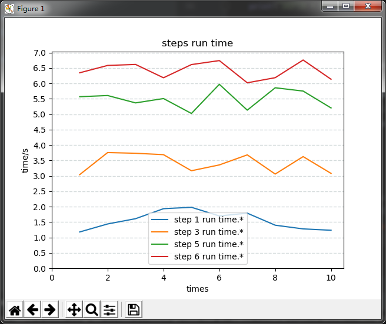

根据关键字提取（手机adb）log 中的时间信息，计算平均值并绘出折线图
# 需求来源
快速统计大量日志中包含的不同方法/算法执行时间的平均值

log 形如：

```LOG
06-05 15:15:13.218 22932 22932 D MainActivity: step 5 run time: 5.369513761587875s
06-05 15:15:13.870 26682 26690 W SQLiteConnectionPool: A SQLiteConnection object for database '/data/user/0/com....
06-05 15:15:13.871 26682 26690 I chatty  : uid=10045(com.android.providers.weather) FinalizerDaemon identical 1 line
06-05 15:15:13.872 26682 26690 W SQLiteConnectionPool: A SQLiteConnection object for database '/data/user/0/com....
06-05 15:15:14.220 22932 22932 D MainActivity: step 6 run time: 6.6173618550226845s
```

而我们关心的部分是 step * run time 后面的时间信息，我们要做的最基本的就是分别提取出每一步的时间并计算平均值。

# 执行本demo 后的输出文本：

```log
step: step 1 run time.* avg:  1.5560642199189967
step: step 3 run time.* avg:  3.419958096268208
step: step 5 run time.* avg:  5.501313495225281
step: step 6 run time.* avg:  6.419683414487264
e_addend_list sum time:  9.839641510755472
group_count 10
```

# 折线图展示结果


# 基本实现逻辑
1. 使用正则表达式从所有日志中过滤出包含时间信息的文本段，这一步得到的结果为
```log
step 0 run time: 0.8911336784355443s
step 1 run time: 1.1810907386805247s
step 2 run time: 2.4233383032426414s
step 3 run time: 3.0417470428523474s
step 4 run time: 4.364102617436791s
step 5 run time: 5.5701353885438145s
step 6 run time: 6.346673583900075s
```
2. 使用正则表达式从上一步的结果中匹配出时间信息  
分别匹配出方法/算法的每一步耗时信息存入list，然后所有步骤的list 再构成一个list，可以理解为是个二维数组。
使用提取出的时间数字计算均值，或者其中某几步的时间之和。
3. 使用matplotlib 绘图展示结果

# 使用方法
已经将需要改动的部分尽量提取到了配置文件config_ex.ini 中  
配置解读：
```ini
;需要分析的日志文件名
[file]
file_name = target_hcz017.log

[e_steps]
; 匹配出所有时间的正则表达式
e_all_step = step.*run time.*
; 需要计算平均值的步骤的这正则表达式，以换行区分每一步，直接新增或删除即可，但新增的step 一定要包含在all_step 过滤出的结果中
e_step_list = step 1 run time.*
;              step 2 run time.*
              step 3 run time.*
;              step 4 run time.*
              step 5 run time.*
              step 6 run time.*
; 这个配置是用来计算所有步骤中某几步的和的，如果不需要可以将等号右边的内容删除
[sum]
e_addend_list = step 3 run time.*
              step 6 run time.*
; 计算平均值时是否需要排除第一组数据，考虑到有些算法第一次初始化比较耗时，在计算平均值时可能需要去除第一组的影响（绘图结果不受此配置影响）
[calc]
exclude_first_snapshot = false
```
# 运行环境
python 3.6 + numpy + matplotlib 

# Todo
1. 将输出结果写入文件
2. 分离步骤，直接从第二步开始执行  
目前直接从第二步开始执行，去读第一步生成的文件会报错。
# PS

这本是一个不复杂的小程序，但本人新手第一次根据自己需求写的python 程序，其中肯定很多不合理不够好的地方，希望大家能提点意见和建议，谢谢。
